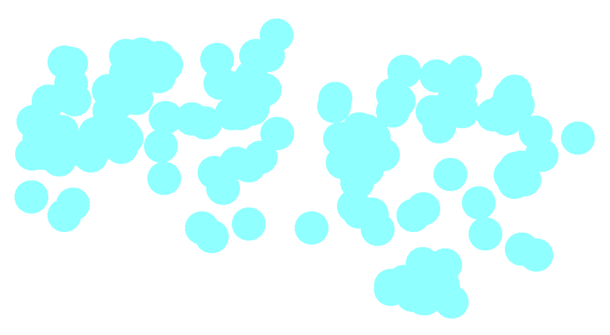

# Lokey iOS

A weird keyboard.

## ☁ Ideas

- Relationship that holds up between regression curves fitted to touch points despite rotation/scaling
- Identify fingers behind each tap, possible to get [radius](http://easyplace.wordpress.com/2013/04/09/how-to-detect-touch-size-in-ios/), then compare relative sizes
- Least Squares as a Maximum Likelihood Estimator (Numerical Recipes)

## ☆ The x problem

x definition is messing up a lot of words -> Bash user input and compare with everything that matches! Will there be any reason to use xs then?

## ☆ Timer

- Wait for all of input then calculate word score
    - 0.5 second timer
    - Show when it's up to see calculation time

## ★ Brain 

- Combines several analyses
    - Snake path: +1 if unbashed path has best of anything
    - Fraction path: take top N from each list
    - UpDown: 
    - Mountains: 

## Neighbors

- Letters right next to each other could give some information. 
- Example: `l` pressed, short distance detected between strokes, then it's probably one of `m` `k` `o` `p`. 
- Go through list of candidates and check that min distances correspond to adjacent letters. Boost likelihood score if so.

## TwoDim

- Gaussian distribution?
- NOT relative to last press if possible -> two modes
- Do a least-squares fit of points suspected to be on same row, shuffle around points to get most parallel set of lines.
- Trace a path through points suspected to be on the same row, and note its curviness.

## Mountains

- Gaussian distribution
- Fit, scale
    - Get endpoints, compress/expand comparisons, integrate difference

## Optimizations

- Can make plist format dictionaries using __Python__
- Use __NSSet__ in snakeDictionary instead of NSMutableArray to do intersection stuff and maybe speedup
- __Average__ fraction paths for words and keep in an __NSMutableDictionary__

## THE FUTURE

- Short words
- Combined score
    - Touch data interpretation
    - Frequency
- Pressing space, shift, punctuation

## Resources

- [Gutenberg frequency lists](https://en.wiktionary.org/wiki/Wiktionary:Frequency_lists#Project_Gutenberg)

